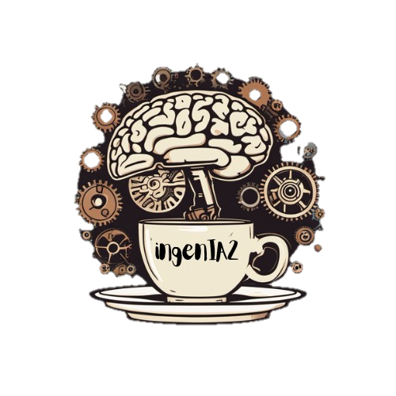
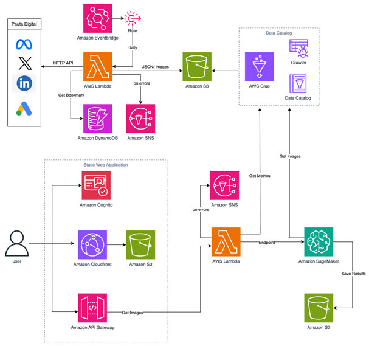

# yenni_ad #


<p style="text-align:center;"></p>


<p style="text-align:center;">by: 
</p>


#### En este repositorio puede encontrarse toda la información referente al desarrollo del proyecto de "Asistente de pauta para analistas de Mercadeo" conocido originalmente como "Recomendador imágenes a partir de métricas de plataformas de pauta" mediante el uso de Inteligencia Artificial Generativa. 
*Proyecto desarrollado en el marco de la Academia Bintec*


- [Contexto y overview](#contexto)

- [Arquitectura](#arquitectura)

- [Relevancia para el negocio](#relevancia-para-el-negocio)

- [Pruebas unitarias y manejo de sesgos en el modelo](#pruebas-unitarias-y-manejo-de-sesgos-del-modelo)

- [Roles de los participantes y sus perfiles](#los-roles-de-los-participantes-y-la-historia-de-cómo-llegamos-a-la-solución)


## Contexto


Cada campaña y cada pieza publicitaria que termina publicada en algún medio, red social o plataforma tiene un montón de historia por detrás. En una combinación entre los analistas de mercadeo, los creativos de las agencias aliadas y los encargados de la última milla de la pauta en las plataformas, también aliados externos, pueden llegar a gastar hasta 2 semanas en ponerse de acuerdo en la pieza final.

Durante este periodo, se pueden ir hasta 5 horas en reuniones de seguimiento, en las que se itera sobre las piezas y se resuelven las diferencias creativas. Si consideramos que son más de 10 equipos diferentes, con al menos tres personas involucradas y que hay pauta permanentemente, podemos hacer un estimado en el que cada año invierten cerca de 39.000 horas.

Nuestra herramienta, mediante una interfaz amigable para los usuarios integra una solución punta a punta para disminuir esta inversión y mejorar el resultado final.

Basada en modelos de Inteligencia Artificial Generativa (GenAI), y de ahí su nombre, Yenni Adboom, asiste a los analistas de mercadeo para que la comunicación con el resto de aliados sea muhco más efectiva. Así, en vez de comunicar mediante una descripción textual lo que quisiera para las piezas gráficas de la campaña, ahora puede hacerlo mediante una imagen. Reza el viejo adagio que vale más una imagen que mil palabras. Esto es lo que logra Yenni.

La solución hace mucho más de lo que parece. Como primera medida, hace uso de la data histórica que se tiene del desempeño de las pautas, esto incluye no solo las piezas gráficas usadas sino sus atributos; como el objetivo de la campaña (awareness, tráfico o conversión), métricas como el número de clics, su alcance, su inversión, costo por clic, etc. Una descripción más detallada está disponible en el diccionario de datos de la tabla donde se centralizó toda la información.

Según las necesidades detectadas en conversaciones con los analistas de mercadeo encargados de la pauta, se tiene que una de las principales ventajas y diferenciadores sobre el proceso actual, es que el volumen de piezas y métricas es tan alto que es humanamente inviable revisar cómo fueron los desempeños para extraer insights valiosos para futuras campañas. Esto es algo en lo que uno de los analistas con quien tuvimos un espacio fue enfático. Según sus palabras: 

> "Meterse en plataformas es tedioso, demorado, comparar pieza por pieza no es algo que se haga ni por el lado del analista ni de la agencia. En un mes pueden ser más de 600 piezas, es imposible revisarlas todas" --S

Con este insumo como lo más importante, la herramienta incorpora modelos muy sofisticados:

De un lado ```clip_interrogator2``` que es capaz de generar una descripción muy completa de la composición de cada imagen, siendo incluso tolerante a las piezas que se encuentran dentro de las plantillas usadas en los distintos canales. Con esto logramos tener la composición y descripción de las imágenes históricas. Esta información se une a la tabla como un atributo adicional de la pieza.

Posteriormente el analista define cuál será el objetivo de la nueva campaña, el nodo al que pertenece (por ejemplo si es de tu360compras, wompi, etc) y una corta descripción de a lo que le apunta la campaña. 

En este punto, un algoritmo basado en reglas claras de negocio relacionadas con las mejores métricas para medir el éxito de una campaña de acuerdo a cada nodo y objetivo, encuentra en el histórico las piezas con el mejor desempeño para lo solicitado por el analista.

Acá entra en juego el siguiente gran modelo, un Large Language Model (LLM), que se encarga de unificar las descripciones de las imágenes seleccionadas en el paso anterior, darle el tono que el analista incluyó en la interfaz y generar una descripción que sirve de prompt para generar la imagen. Para este punto utilizamos ```llama2```, específicamente la versión ``TheBloke_Llama-2-13B-chat-GPTQ``, desarrollado por Meta y con una licencia gratuita y con un alcance amplio. Este modelo mostró tener un gran desempeño, según la investigación realizada, evitando así la necesidad de un modelo mucho más robusto y pesado como su versión de 70B.

Finalmente, el último gran modelo que utilizamos es el de ```Stable Diffusion XL 1.0```, un modelo de difusión latente (LDM por sus siglas en inglés) que de igual manera es de licencia abierta y que permite generar imágenes a partir de texto (dentro de muchas otras posibilidades que no incorporamos pero que podrían venir en un posterior desarrollo de Yenni).

Con este modelo se generan 4 imágenes diferentes a partir de la misma descripción que luego se le muestran al analista en la interfaz inicial, sin que tenga necesidad de saber lo que está pasando por debajo del capó y en la que puede escoger la o las que le parezcan pertinentes para transmitir la idea que tiene al resto de los involucrados.

De esta manera, la comunicación se hace mucho más efectiva y se espera reducir en un 50% la cantidad de horas necesarias para llegar a la pieza final, liberando estas horas para todas las otras tareas que a diario enfrentan los analistas y contribuyendo indirectamente a su bienestar.

[Volver al inicio](#yenni_ad)

-------------

## Arquitectura

El diagrama presentado a continuación resume la arquitectura, que se describe posteriormente:




Esta arquitectura se compone de varios servicios de AWS que trabajan en conjunto para lograr orquestar de una manera eficiente, escalable y disponible los siguientes componentes:

1.	Recolector de datos

Este proceso de la arquitectura se encarga de recolectar, almacenar y disponibilizar los insumos necesarios, desde las diferentes plataformas de pauta web (Meta, X, LinkedIn, Google ads)
Los datos que se obtienen en este proceso son los siguientes:
•	Campañas
•	Anuncios
•	Metricas de los anuncios
•	Creatividades de los anuncios
•	Imágenes de los anuncios

**¿Como funciona?**

El Eventbridge tienen una regla configurada para que todos los días a las 7am ejecute una función Lambda.

La función Lambda consulta en la tabla “bookmark” de dynamoDB cuál fue la última fecha de ejecución exitosa para cada una de las plataformas y consume las API obteniendo los datos de los nuevos anuncios.

Se almacenan los datos en el bucket de S3 particionados por año, mes, dia, plataforma y cuenta publicitaria y se guarda el nuevo bookmark en la tabla de dynamoDB

En caso de que la función lambda arroje algún error durante la ejecución, se dispara un mensaje por correo electrónico mediante un topic de SNS al equipo IngenIA2.0 para su revisión y corrección.

El Crawler de GLUE se ejecuta todos los días a las 8:00am, identificando las nuevas particiones y los nuevos datos almacenados en el bucket de S3 y actualiza el Glue data Catalog para que pueda ser consumida la data fácilmente por los otros consumidores.


2.	Aplicación WEB

Sitio web estático desarrollado en REACT con el que interactuarán los usuarios de Yenni Ad.

**¿Como funciona?**

El sitio web estático  se almacena en el bucket de S3 y se distribuye por medio de Cloudfront.

La autenticación se gestiona por medio de los users groups de Cognito.

Api Gateway gestionará la comunicación entre el front y el back que en nuestro caso será una función Lambda.

La función lambda recibe los datos enviados desde el front (nodo, objetivo, y descripción de la audiencia) consume el Glue data Catalog para determinar cuáles son las imágenes vinculadas a los anuncios que mejores resultados tuvieron, de acuerdo a los datos ingresados y activa el endpoint de Sagemaker enviando el dataset resultante.

En caso de que la función lambda arroje algún error durante la ejecución, se dispara un mensaje por correo electrónico mediante un topic de SNS al equipo IngenIA2.0 para su revisión y corrección.


3.	Componente ML	

El endpoint de sagemaker es consumido por la función lambda y recibe los parametros necesarios para la ejecución de los diferentes modelos que arrojarán un array con al menos cuatro imágenes que serán la recomendación para el usuario.

Los resultados se almacenan en el bucket de S3 y se devuelven al front para que sean recibidos por el usuario.

-----------------
[Volver al inicio](#yenni_ad)

## Relevancia para el negocio


¿Cuál es nuestro mercado?

Los destinatarios principales de la solución son los analistas de mercadeo, quienes son los que construyen el documento que recoge las principales características de la futura campaña (conocido como brief) y lo comunican a las agencias creativas (beneficiarios secundarios), que generan una primera versión que luego de varias iteraciones termina con el resultado final. Son estos últimos quienes conectan la pieza con los encargados de las plataformas de pauta.

¿Qué costumbres tiene nuestro cliente interno de mercadeo?

Nuestro cliente genera una primera solicitud con las ideas esenciales que ha definido (brief). Posteriormente suele tener reuniones en las que se evalúa la pertinencia de ciertas licencias creativas y se realizan observaciones. Se generan varias iteraciones a partir de la realimentación y finalmente se deciden cuáles son las piezas definitivas.

Este proceso tiene mucha variación dependiendo de la complejidad de la pieza y la importancia jerárquica de la campaña de la que harán parte las piezas.


¿Qué necesidades tiene nuestro cliente?

- Poder transmitir de una manera más concreta la idea base para la campaña, basado en su conocimiento del negocio para que el creativo de la agencia lo pueda entender más fácil y evitar reprocesos.
- Que las observaciones que realizan los analistas en las reunines de seguimiento sean tenidas en cuenta por parte de las agencias.
- Poder analizar y tener en cuenta las piezas exitosas que se dieron en el histórico de las campañas y que son muchas y muy voluminosas como para hacerlo a mano.

¿Cuál es diferencial?

Actualmente no existe al interior del banco una solución que integre data histórica con generación de imágenes. También, la ventaja competitiva está dada por la facilidad de uso y la posibilidad de plasmar en imágenes las ideas, lo que se traduce en la facilidad para el cliente de transmitirlas de una manera más tangible, mediante el uso de algunas alternativas visuales de referencia.

¿Satisfacemos las necesidades?

Sí. El producto logra llegar a una propuesta base visual, que recoge la idea abstracta del analista. Esto ayuda a que sus observaciones sean más comprensibles. Adicionalmente incorpora la posibilidad de tener en cuenta el desempeño histórico de las campañas, para resaltar los elementos presentes en aquellas piezas que hayan sido las más exitosas de acuerdo con los objetivos que persiguen (awareness, consideración, conversión, etc) y sus respectivas métricas.

¿Cómo se llama el producto?

Inspirados por las siglas de la Generative AI, queriendo también darle un toque en español (IA en vez de AI) y considerando el tono descomplicado y amigable y la simplicidad en su uso, optamos por darle el nombre de Yenni Adboom, conocida también como Yenni Ad o simplemente como Yenni.

Este nombre busca también ser compatible con las nomenclaturas que usa el banco para sus herramientas, considerando por ejemplo a Sofy. Esto adicionalmente nos da la libertad para poder, bajo el mismo nombre, agregar a futuro funcionalidades que complementen a Yenni y la hagan la asistente virtual no solo de pauta sino de todo mercadeo.


¿Cómo se resumiría la relevancia para el negocio?

Nuestra solución usa modelos de IA Generativa, también llamados modelos fundacionales, para optimizar los procesos relacionados con la pauta del área de mercadeo, potenciándolos con el uso de la data histórica, mediante una interfaz sencilla. Esto permite ahorrar muchas horas de trabajo a los distintos invlolucrados y mejora la eficiencia de los recursos. Los gastos relacionados con este proceso frente a las agencias oscilan entre los 200 y los 300 millones de pesos y si bien no todo está relacionado con estos procedimientos podríamos igual hacernos una idea de lo que una reducción del 50% en los tiempos generaría en beneficios.

Es de destacar que la privacidad de la información está resguardada por cuanto nunca se ingresa información a servicios de terceros y todos los datos se usan en un entorno local o nube controlado.

¿Qué se viene para el futuro?

Si la idea encuentra respaldo, la herramienta tiene varias líneas en las que puede crecer. En primera medida se puede agregar la posibilidad de iterar sobre las imágenes generadas, ajustando temas como estilos predefinidos y permitiendo ingresar un bosquejo o dibujo de base.

De la misma manera, en algún punto puede dársele una interfaz tipo chatbot, que asista en los deberes del día a día de los analistas y cuya funcionalidad no se limite a ser un generador de imágenes.

[Volver al inicio](#yenni_ad)

-----------------------------

## Pruebas unitarias y manejo de sesgos del modelo.


El uso de los modelos de IA generativa comporta un riesgo de sesgos derivados de la data con la que fueron entrenados. En el caso del clip_interrogator, esto podría evidenciarse en que las descripciones tendieran a ser principalmente sobre adultos blancos jóvenes. No obstante se ensayó con imágenes usadas en pauta que mostraban población indígena y esta característica fue detectada e incluida en la descripción de manera automática.

Unido a esto, al solicitar la integración de distintas descripciones en un mismo prompt, se tiene el control para solicitar que s eincorpore elementos clave adicionales que el modelo siempre deberá tener en cuenta, tales como la naturalidad de las personas, la calidez de las imágenes y en general las que vienen determinadas por el manual de marca.

Adicional a esto, dentro de los parámetros configurables del modelo está el de la "escala de guianza" (CFG, en inglés), que controla qué tanto de la descripción se debe seguir al pie de la letra y qué tanto puede dejarse a la "creatividad" del modelo y al azar.

Este parámetro cobra aún más relevancia cuando se hace énfasis en que se presenta un cambio importante en la marca: se decide empezar a usar personas más reales, más representativas de Colombia, en contraposición a imágenes de catálogos que tenían ragos notoriamente extranjeros. 

Si bien esta situación podía presentar algún inconveniente teniendo en cuenta que el modelo se alimenta de las piezas históricas, las descripciones obtenidas mediante CLIP se usaron en un nivel medio de profundidad, lo que hace que estas no fueran demasiado al detalle, sino que fueran una descripción de la composición general junto con los estilos.


Aún más. Al hacer pruebas con distintos prompts, se encontró que los resultados obtenidos no eran particularmente reflejo de alguna etnicidad en particular y que al incluir palabras como indigenous o local, o incluso colombian, el modelo hacía un buen trabajo generando imágenes con una buena calidad de referencia.

Finalmente, debe decirse que las imágenes generadas no pasan a ser usadas en la pauta, simplemente constituyen una fuente adicional de inspiración, y es que las agencias deben usar imágenes del banco de imágenes del banco, por lo que habría un filtro adicional de seguridad en ese sentido. Las imágenes generadas permiten comunicar mejor la idea y eventualmente buscar la foto o fotos (dentro de la colección del banco, que reflejen esa idea).

También es cierto que no siempre se obtienen los reusltados deseados al primer intento, por lo que cuando se habilite en el futuro la opción de iterar y regenerar las imágenes, esto tendría el efecto secundario de permitir combatir los sesgos en caso de que las imágenes generadas adolezcan de ellos.

[Volver al inicio](#yenni_ad)

------------------------


## Los Roles de los participantes y la historia de cómo llegamos a la solución.

Antes de mencionar los perfiles de los integrantes del grupo y de los roles que cada uno tuvo en el desarrollo de este producto, partamos de cómo llegamos al tema de la IA Generativa.
Al pertenecer todos del área de mercadeo, estamos rodeados de mucho contenido audiovisual. No obstante hacer parte de nuestro día a día una gran porción de nuestras actividades está relacionada es con los datos que se generan a partir de los distintos contenidos. Es decir la mayoría del tiempo estamos lidiando con datos principalmente estructurados. 

Siendo personas curiosas e interesadas por aprender, empezamos a idear y a pensar con el equipo sobre qué productos o servicios podríamos brindar, desde nuestras habilidades complementarias, teniendo en cuenta especialmente los desarrollos en IA que se fueron presentando de una manera explosiva y que parecen haberse acelerado con la salida de ChatGPT. Pensamos en sistemas de reconocimiento facial para hacer estudios sobre las reacciones de la gente frente a las piezas de video, visión computacional para detectar objetos y clasificarlos dentro de las piezas y una gran cantidad de ideas. 

Nos fuimos preparando e investigando sobre distintos temas relacionados y luego la convocatoria para la Academia Bintec fue lo qeu unió todas esas ideas y les dio forma. Vimos que había una gran cantidad de datos sin explotar en la pauta y modelos que permitían darle un toque llamativo a los ejercicios y procesos del día a día que podían generar valor y de paso nos permitirían aprender sobre temas nuevos e interesantes.

Es en ese momento que decidimos juntarnos teniendo en cuenta, como fue mencionado, nuestras distintas habilidades complementarias. Veamos pues quiénes somos y qué roles tuvimos en el desarrollo del proyecto:

- **Camilo Andrés De la Cruz Arboleda:** Se desempeña como Científico de Datos en asuntos relacionados principalmente con Fidelización y Marca. Apasionado por la generación de contenido audiovisual a partir de IA, fue el encargado de conectar los distintos modelos (CLIP, Llama2, SDXL) que permitían llegar a la generación de imágenes.  

- **Alejandro Mendoza Foronda:** Se desempeña como Ingeniero de Datos, apoyando equipos de manera transversal en todo lo relacionado con disponibilizar los datos y la generación de audiencias en Segment. Un enamorado de los servicios de nube, fue quien tuvo a cargo el planteamiento y desarrollo de la arquitectura mediante los servicios de AWS, para conectar todas las piezas de la solución.

- **Santiago Humberto Londoño Restrepo:** Se desempeña como Científico de Datos en asuntos relacionados con Ecosistemas, o especíicamente, en los tu360's (inmobiliario, compras, etc). Un demente de la analítica de datos y de encontrar patrones ocultos, fue quien estuvo a cargo de encontrar la mejor manera de detectar las imágenes con el mejor rendimiento de acuerdo con los objetivos buscados y los indicadores. Adicionalmente coordinó varios de los encuentros con los analistas, para entender mejor sus necesidades y su día a día.

- **Gustavo Ernesto Ramírez Espinoza:** Se desempeña como Ingeniero de Software y es quien le da el toque mágico a la interfaz. Obsesionado con el Front-end, es todo un experto en frameworks y en generar diseños limpios, sencillos y con una gran experiencia de usuario, que además sean utilizables en distintos dispositivos sin problema. Como es de suponerse fue el encargado de realizar la interfaz web en la que reposa Yenni.

[Volver al inicio](#yenni_ad)

### Reconocimientos y agradecimientos:
Al líder del área Juan Pablo Duque quien siempre estuvo dispuesto a apoyarnos en lo que se requiriera y nos dio la posibilidad y los tiempos para dedicarle a la herramienta.

A los organizadores, por fomentar el crecimiento personal y el intraemprendimiento.
